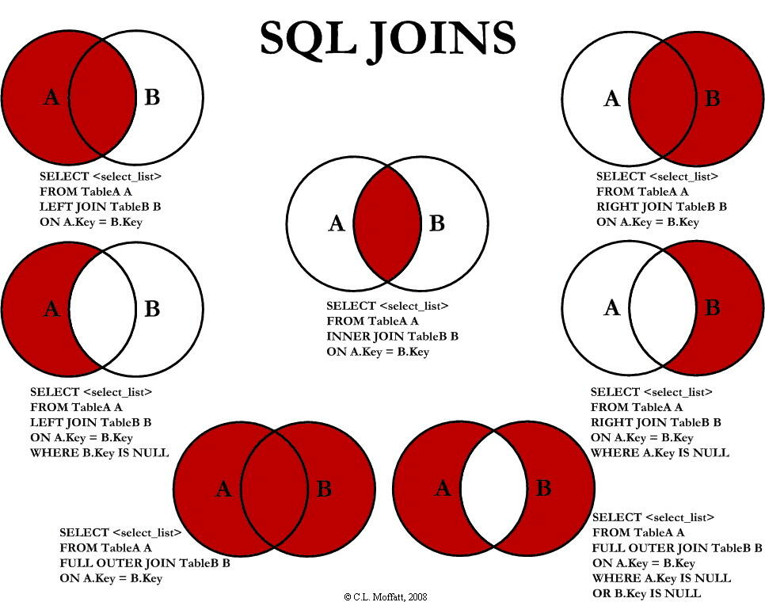
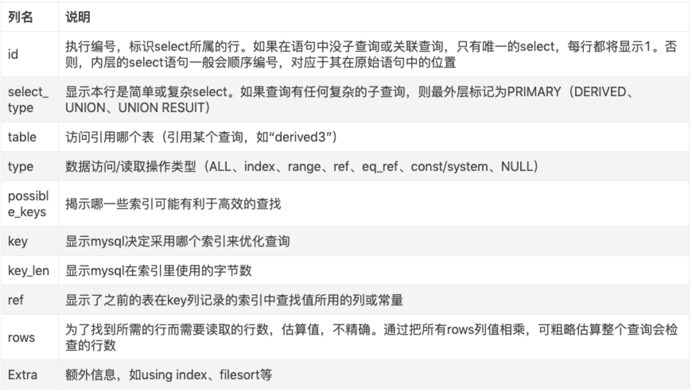

# Mysql

## 概念

[MySQL 三万字精华总结 + 面试100 问，和面试官扯皮绰绰有余（收藏系列）](https://juejin.cn/post/6850037271233331208)

### 索引

[详解Mysql索引原理及其优化](https://juejin.cn/post/6844903909899632654)

## 配置

### only_full_group_by 模式

## 数据库操作

### 数据库服务

```jsx
mysql.server start // 启动macos 通过 brew 安装
```

### 登录

```sql
mysql -u root -p // 登录本地
mysql -h 127.0.0.1 -u root -p -P 3306 // 指定ip、端口登录
```

登录成功进入 `mysql >`输入界面

### 创建数据库

```sql
create database db_name;
```

### 删除数据库

```sql
drop database db_name;
```

### 选择数据库

```sql
use db_name;
```

## SHOW - 查看数据库相关信息

查看数据库列表

```sql
show databases;
```

查看指定数据库的表

```sql
show table from db_name;
```

查看表的字段信息

```sql
show columns from table_name;
```

查看表创建 sql

```sql
show create table table_name
```

查看数据表索引

```sql
show index from talbe_name;
```

查看状态信息

```sql
show status;
```

查看变量

```sql
show variables;
```

查看表状态信息

```sql
show table status
```

## 表操作

### 创建数据表

```sql
CREATE TABLE IF NOT EXISTS `table_name`(
   `id` INT UNSIGNED AUTO_INCREMENT,
   `title` VARCHAR(100) NOT NULL DEFAULT 'value' COMMENT '备注：标题',
   `author` VARCHAR(40) NOT NULL,
   PRIMARY KEY ( `id` )
)ENGINE=InnoDB DEFAULT CHARSET=utf8;
drop table table_name
```

- **NOT NULL**不允许为空值。
- AUTO_INCREMENT定义列为自增的属性，一般用于主键，数值会自动加1
- COMMENT 字段备注
- PRIMARY KEY关键字用于定义列为主键。 您可以使用多列来定义主键，列间以逗号分隔。
- ENGINE 设置存储引擎，CHARSET 设置编码。

### 删除表

```sql
drop table table_name
```

### 修改表结构 - ALTER

```sql
ALTER TABLE table_name ADD column_name INT(5) NOT NULL DEFAULT 0 AFTER prev_column_name;
```

> 在prev_column_name字段后面创建不允许空、默认值 0、长度5的整型字段column_name

- AFTER：指定新增字段在哪个字段后面，换成FIRST则在最前面，不写则在最后；
- NOT NULL：不允许空，如果换成 NULL则是允许空；
- DEFAUYLT：默认值，不写则默认值为 NULL；

### 删除字段

```sql
ALTER TABLE table_name DROP column_name;
```

### 修改字段

在原有字段上修改（名称不变）

```sql
ALTER TABLE table_name MODIFY column_name VARCHAR(20) NOT NULL DEFAULT 'default-value';
```

替换成新字段（名称改变）

```sql
ALTER TABLE table_name CHANGE column_old column_new BIGINT;
```

修改默认值

```sql
ALTER TABLE table_name ALTER i SET DEFAULT 1000;
```

删除默认值

```sql
ALTER TABLE table_name ALTER column_name DROP DEFAULT;
```

### 主键

修改主键（需要先删除主键，再添加）

```sql
ALTER TABLE table_name DROP PRIMARY key ADD PRIMARY key('id', 'name'), 
```

## 表数据操作

### 查询

#### mysql 查询执行逻辑

书写顺序
select->distinct->from->join->on->where->group by->having->order by->limit

执行顺序
from->on->join->where->group by->sum、count、max、avg->having->select->distinct->order by->limit

注意点:
where 效率比 having 高，所以尽可能用 where 过滤条件
执行过程中，关键步骤都会生成虚拟表，后续操作都是在当前虚拟表中操作，再生成新的虚拟表

#### 关键字

```sql
SELECT column_name,column_name 
FROM table_name 
WHERE con1 = '1' AND  con2 = '2'
ORDER BY column1 DESC, column2 ASC
LIMIT 10 
OFFSET 100
```

**FROM** 表名，可以指定多个表并通过WHERE限定条件进行关联查询，同时可以指定表别名

```sql
SELECT * FROM tableA a, tableB b WHERE a.columnA = b.columnB
```

**WHERE 子句** 查询条件，可使用 AND 或者 OR 查询多个条件

**LIKE** 模糊匹配，类似于 = 操作符，但是可以通过%匹配任何字符 `WHERE con1 LIKE '%1' AND con2 = '2%'`

**ORDER BY** 排序，ASC 生序，DESC 降序

**LIMIT** 查询数量

**OFFSET** 偏移量，从第n条记录之后开始查询

### 大小写问题

utf8_general_ci 字符集不区分大小写，uft8_bin 字符集区分大小写，可以单独设置某个字段的字符集

### 高级查询

**聚合**

聚合函数 `COUNT`, `SUM`, `AVG`, `MAX`, `MIN`,以及结合聚合函数使用的 `GROUP BY`

```sql
# 所有行数
select count(*) from table_name;
# age 值不为 NULL 的行数
select sum(age) as total from table_name;
# age 值不重复的行数
select sum(distinct age) from table_name;
# GROUP BY 在聚合的基础上分类，如果末尾加上 WITH ROLLUP 会额外统计出总数
SELECT name, SUM(price) as pricee_count FROM  order GROUP BY name WITH ROLLUP;
```

**group by**

用于集合数据

```sql
如果 select 出来的字段不在 group by 中，且有差异，只会取第一条，下面中的 id 是第一个用户的 id
select id, age from users group by age;
根据年龄聚合用户列表，同时将相同年龄的名字加在一起
select age, GROUP_CONCAT(name) from users group by age;
根据年龄聚合用户列表，同时计算出总年龄
select age, sum(age) from users group by age;
```

如果需要对 group by 之后的结果进行条件筛选，则用 HAVING 子句来，用法跟 WHERE 一样

only_full_group_by 模式

含义：使用 group by 的时候，select 的字段必须再 group by 的字段列表中。
错误：select name, age from users group by age
正确：select name, age from users group by age, name

mysql 默认开启，建议关闭该模式，因为导致 sql 会很不灵活：
查看是否有开启 `select @@sql_mode;`
去掉该模式重新设置值 `set @@sql_mode;`

**去重**

```sql
# distinct 找出 column1, column2 都不同的字段，两者是“且”的关系
select distinct column1, column2 ... from table_name;
```

**表关联查询 JOIN**

用于结合多个表数据，有 `LEFT JOIN`、`RIGHT JOIN`、`INNER JOIN(可简写 JOIN)`、`OUTER JOIN`

  

```sql
SELECT
  b.FOfferID,
  b.FToBOfferID,
  o.FCurrencyID,
  c.FServiceCode,
  c.FEnvFlag
FROM
  t_offer_bus AS b
JOIN t_offer AS o ON (b.FToBOfferID=o.FOfferId)
JOIN t_currency AS c ON (c.FCurrencyID=o.FCurrencyID)
WHERE
  c.FEnvFlag = 1 and b.FOfferID = '123123123';
```

一些要点：

- `LEFT JOIN` 和 `RIGHT JOIN` 在更改表顺序下可以实现完全相同的效果，所以一般建议只用 `LEFT_JOIN`（例如 `a LEFT JOIN b` 等效 `b RIGHT JOIN a`）
- `FULL JOIN` mysql 默认不支持，可以通过 `LEFT_JOIN` `union` `RIGHT_JOIN` 实现

**字段合并**

```jsx
# CONCAT_WS 的第一个参数指定分割符
select FOfferID, CONCAT_WS(',', FBusinessID, FGroupID) as 'group' from t_wholesale_offer_ext where FOfferID = '1450016120';
# CONCAT 手动插入分割符
select FOfferID, CONCAT(FBusinessID, ',', FGroupID) as 'group' from t_wholesale_offer_ext where FOfferID = '1450016120';
```

### 插入

```sql
INSERT INTO table_name (column1, column2,...columnN)
VALUES (value1, value2,...valueN);
```

### 更新

```sql
UPDATE table_name SET field1=new-value1, field2=new-value2 [WHERE Clause]
```

需要指定where条件确定需要更新的一条记录

### 删除

```sql
DELETE FROM table_name [WHERE Clause]
```

## 数据库重命名

- mysqldump 备份到新数据库
- 重命名数据库里面的所有表

## 数据导入导出

### 导出sql (mysqldump)

```bash
1、导出数据库为dbname的表结构（其中用戶名為root,密码为dbpasswd,生成的脚本名为db.sql）
mysqldump -uroot -pdbpasswd -d dbname >db.sql;

2、导出数据库为dbname某张表(test)结构
mysqldump -uroot -pdbpasswd -d dbname test>db.sql;

3、导出数据库为dbname所有表结构及表数据（不加-d）
mysqldump -uroot -pdbpasswd  dbname >db.sql;

4、导出数据库为dbname某张表(test)结构及表数据（不加-d）
mysqldump -uroot -pdbpasswd dbname test>db.sql;

5、导出数据中dbname多张表（test1,test2,test3）结构及表数据用用空格隔开
mysqldump -uroot -pdbpasswd dbname test1 test2 test3>db.sql;

6、导出时增加查询条件
mysqldump -uroot -pdbpasswd -d -w"<where> <order by> <limit>" dbname test>db.sql;

7、报错：Access denied ... when doing LOCK TABLES，忽略 lock table 权限
mysqldump -uroot -pdbpasswd -d dbname test>db.sql --single-transaction;

8 导出单行 insert
mysqldump -uroot -pdbpasswd dbname test1 test2 test3 --extended-insert=FALSE>db.sql;
```

一些有用的选项

- —complete-insert 导出的 insert 语句包含字段名称
- --default-character-set=utf8

### 倒出 excel

```sql
select * from table into outfile 'xxx.txt';
```

### 导入sql文件

方法一

1. 选择数据库mysql>use abc;
2. 设置数据库编码mysql>set names utf8;
3. 导入数据`mysql> source /home/abc/abc.sql;`

方法二

`mysql -u用户名 -p密码 数据库名 < file.sql`

## 性能

EXPLAIN 分析查询语句的性能

```sql
是需要在查询语句的前面加上 EXPLAIN 关键字
EXPLAIN SELECT * FROM user WHERE nickname = 'tom';
```

  

### 全文索引

## 用户管理

```sql
grant all privileges on subscribe.* to username@'%' identified by 'password'; // 创建用户并授权
flush privileges; // 刷新权限使之生效
```