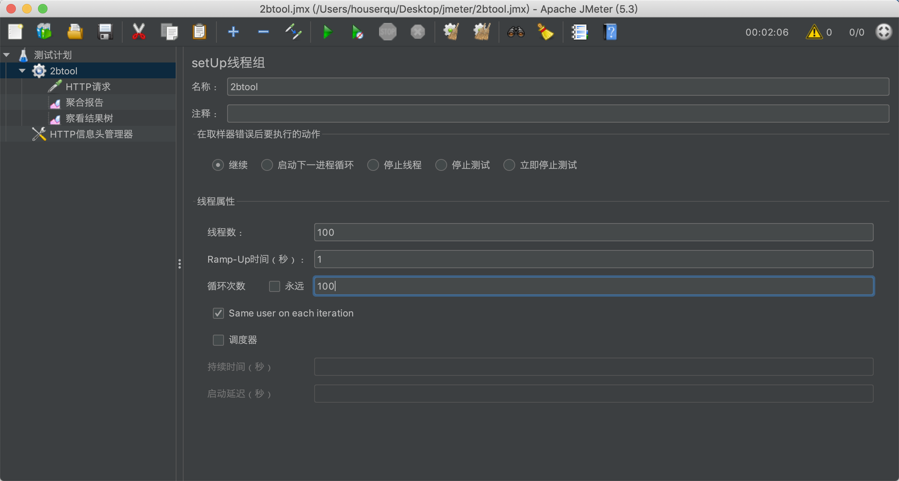
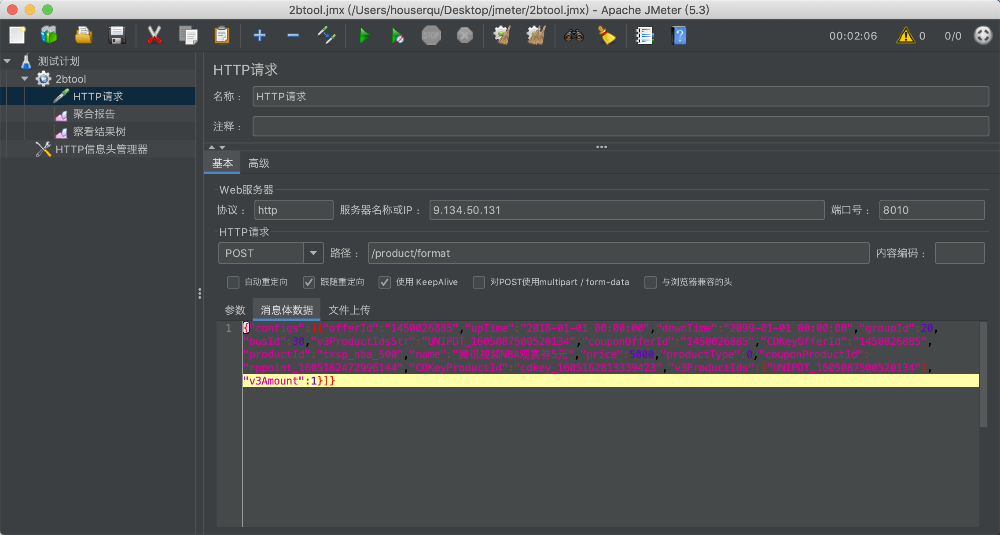
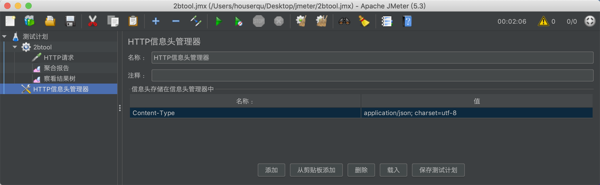
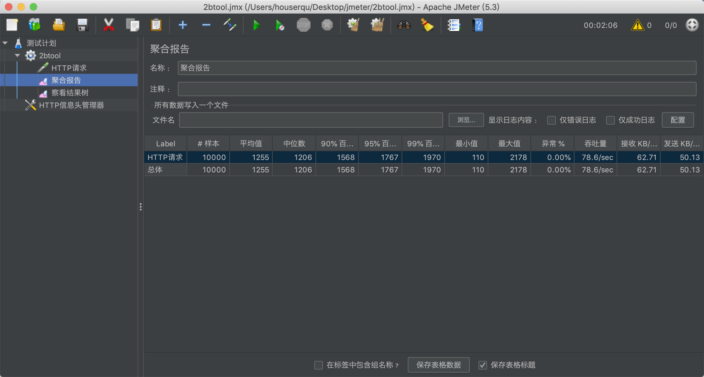
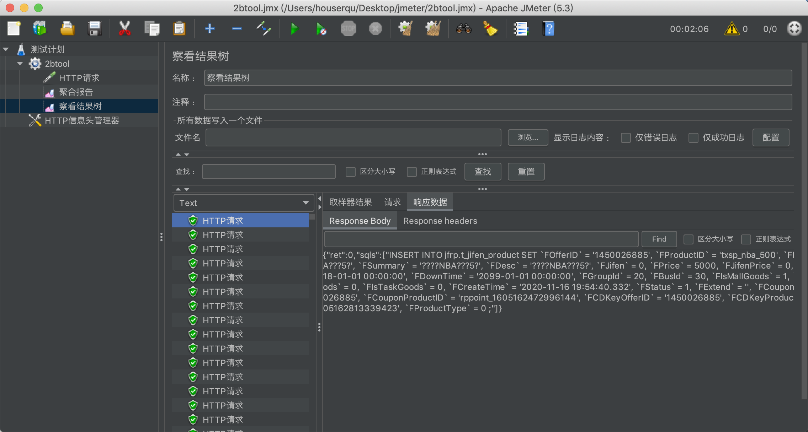

# Jmeter 使用笔记

Jmerter 是用 java 开发的，需要 java 运行环境，下载之后直接通过命令行运行 `./bin/jmeter` 启动可视化界面。

1. 在测试计划下面创建用户组
    线程数：代表用户数
    Ramp-Up：启动所有线程的时间，可以理解为这些用户在多长时间内进行访问
    循环次数：一个用户发起的请求数量
    如图代表 100 个用户在 1s 内人均发起 100 次请求，总共 10000 次请求

  

2. 在用户组下创建 HTTP 请求地址

  

需要注意的是请求头需要在【HTTP信息头管理器】里单独配置

  

1. 添加监听器，获取请求结果
聚合报告：查看所有请求的统计数据

  

查看结果树：查看每个请求的请求情况

  
