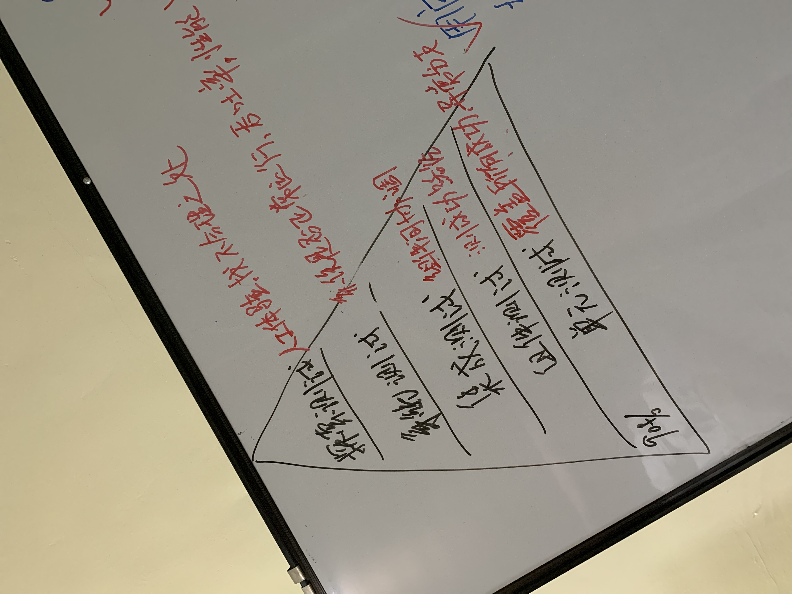

# 单元测试

## 测试工具

Jest，Mocha

## 基于 Jest 一些测试技巧

### 至少包含两层嵌套分类

合理的分类能够让测试用例看起来更直观方便

```jsx
describe('保存活动号', async () => {
  describe('旧活动', async () => {
	  it('存储道具类活动', () => {})
    it('存储包月类活动', () => {})
  })

  describe('新活动', async () => {
    ...
  })
})
```

### 模拟模块

当测试的方法使用了其他不需要关心内部逻辑的模块的时候，可以模拟该模块对象属性和方法的返回值。例如请求模块、日志模块。在测试存在依赖的方法的时候，非常有用。

```jsx
// 在测试文件顶层声明需要模拟的模块，可以是 node_modules 中的模块，也可以是项目中的模块
jest.mock('./util/requestData', () => {
  return function () {
    return {status: 0, data: {rulesetid: 'DRM190530110900000749'}}
  }
})

// 当被测试的方法使用了该模块的时候，会被替换成模拟模块
```

### 测试数据库存储逻辑

在 node 中，经常会用 sequelize 等库将数据表定义成 model，每一条记录是 model 实例的对象，增删改查直接调用实例提供的方法，这时可以使用模拟方法来测试数据存储是正确。

```jsx
// 定义模拟方法，直接返回需要验证的数据
const mockSave = jest.fn(function () {
    return this.FGroupID
  })

// 被测的 saveGroupId 方法会接收一个 model 对象，按照一定逻辑更新 FGroupID 值，
// 并调用自身的 save 方法完成数据库 update 操作，
// 只需要模拟 save 方法并断言该方法的返回值是否符合预期就可以了
it('保存活动号', async () => {
  await saveGroupId({FVersion: 1, FGroupID: '', save: mockSave}, 'TOB200305144551140', 'goods')
  expect(mockSave.mock.results[0].value).toBe('TOB200305144551140')
})
```

  
