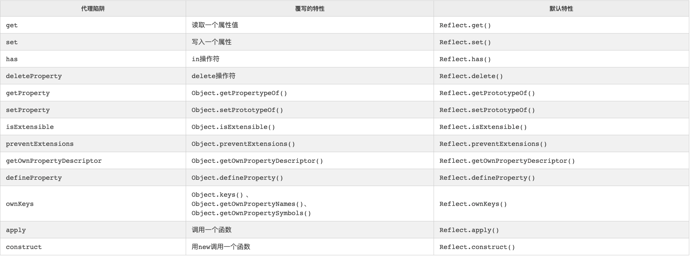

# Proxy/Reflect

## Proxy

### 定义

Proxy 对象用于定义基本操作的自定义行为（如属性查找、赋值、枚举、函数调用等）。

### 用途

利用Proxy可以拦截对象的 get、set、delete 操作，进行一些自定义操作，例如参数校验、格式转换等。

如果对象属性配置了`configurable: false` 與 `writable: false`，则不能被 proxy 拦截

### this 问题

Proxy 代理的对象的 this 指向的是 Proxy，如果需要指向原始对象可以通过 bind 解决

```sql
let div = document.querySelector('div'); // 随便拿一个页面的 div, 对他进行代理

// 第一种代理方法
let divProxy = new Proxy(div, {
  get: function (target, key, receiver) {
    // 访问这个 div 的任何属性，都直接返回
    return target[key]; // target[key].bind(target); 这样让 this 指向原对象
  }
});
// 调用 div 的 querySelector 方法，拿他下边的 a 标签
// chrome 上会报错：Uncaught TypeError: Illegal invocation
console.log(divProxy.querySelector('a')); 
```

### 参考

[https://developer.mozilla.org/zh-CN/docs/Web/JavaScript/Reference/Global_Objects/Proxy](https://developer.mozilla.org/zh-CN/docs/Web/JavaScript/Reference/Global_Objects/Proxy)

## Reflect

### 定义

Reflect 是一个内置的对象，它提供拦截 JavaScript 操作的方法。这些方法与proxy handlers的方法相同。Reflect不是一个函数对象，因此它是不可构造的。

### 用途

Reflect 可是个静态对象，可以接受目标对象作为参数，并执行该对象的方法

### 示例

```sql
const duck = {
  name: 'Maurice',
  color: 'white',
}

Reflect.has(duck, 'color');
// true
Reflect.has(duck, 'haircut');
// false
```

一般 reflect 会跟 proxy 一起使用，通过 reflect 去修改属性，而不是直接访问属性

```sql
const handler = {
  get(target, prop) {
    return Reflect.get(target, prop);
  }
};
const proxy = new Proxy({}, handler);
```

## Proxy 与 Reflect 的不同

调用方式不同，但是能实现的功能是相同的

  
