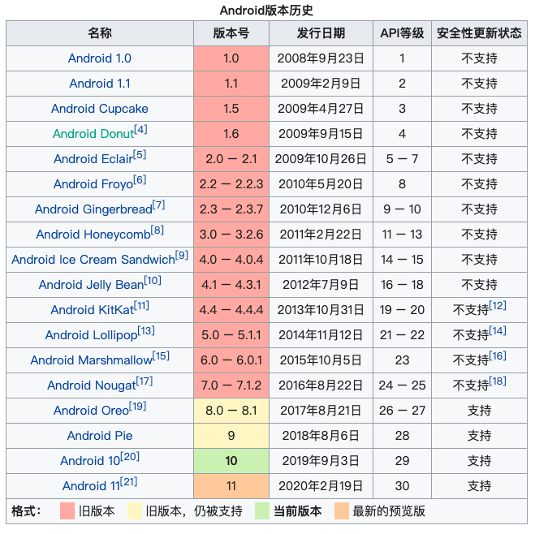

# Android

## 安卓版本时间

  

## 模拟器

Genymotion

在 intel 处理器电脑上，无法直接安装 arm 架构的 app，需要先安装一个翻译程序

[https://github.com/m9rco/Genymotion_ARM_Translation](https://github.com/m9rco/Genymotion_ARM_Translation)

## 网络

宿主机IP：10.0.3.2

代理设置：在 wifi 的高级设置进行配置