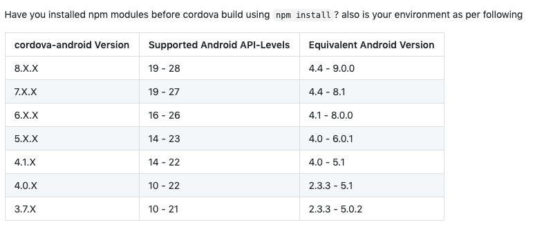

# Cordova

cordova 生态已经越来越差了，如果不会原生开发，不建议使用，推荐 apicloud，有官方维护，但是可能会收费。

  

## 插件

- 官方 crosswalk 已经停止维护，这个库可以继续支持新版 cordova
[https://github.com/ardabeyazoglu/cordova-plugin-crosswalk-webview-v3](https://github.com/ardabeyazoglu/cordova-plugin-crosswalk-webview-v3)

## 其他

启动图生成

[https://console.eeui.app/tools/launchimage](https://console.eeui.app/tools/launchimage)

## 问题

crosswalk ssl 问题：

如果用了 whistle 代理，ajax 请求就会提示 crosswalk request was denied for security

应该是自签名的证书 crosswalk 不认

[http://ivancevich.me/articles/ignoring-invalid-ssl-certificates-on-cordova-android-ios/](http://ivancevich.me/articles/ignoring-invalid-ssl-certificates-on-cordova-android-ios/)