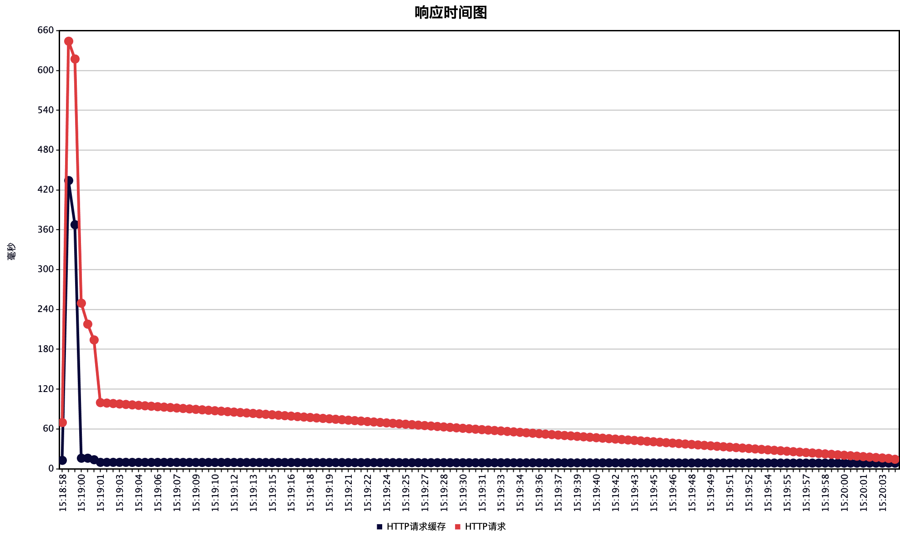

# 后端开发指南

## 接口协议

后端需要提供一个固定响应数据结构，便于前端做统一处理

建议所有请求都使用 POST 方式，数据类型是 JSON，方便后端获取参数以及数据类型

响应体结构：

```jsx
{
  code: 0           // 错误码：0 = 成功
  msg: '成功'        // code !== 0 时代表错误描述
  data: {},         // 数据
  t: 1593778883122, // 服务器时间戳
}
```

## 错误码

原则：错误码需要能够直观的判断出错误原因

### 简单错误码

对于中小型系统，可以直接使用字符串作为错误码，好处是不用再维护映射表，通过错误码能直接判断出错误。

例如： `code=INVALID_USER`

格式：大写单词，下滑线作为间隔，不能有空格

### 复杂错误吗

复杂的大型系统，用字符串错误码可能无法覆盖所有的错误场景，多个系统还容易出现重名的情况，这时候建议使用数字或者数字字符串组合的错误码，而且需要额外的维护错误码和错误内容的映射表。

下面是阿里推荐的错误码格式

**内部错误码**

错误码格式：`{错误类型-大写字母}{应用标示-字母}{功能模块-2位数字}{错误编码-3位数字}`

错误类型：

- P 参数错误
- B 业务错误
- N 网络错误
- D 数据库错误
- F 文件IO错误
- O 第三方系统错误
- S 系统错误（运行时错误）
- A 权限错误

示例：`PA02011` `BA12091`

当来源于其他系统而报的错时，需要携该错误码

**外部错误码**

{错误类型}{错误编码-4位，大类之间步长100}

错误类型：

A: 来源于用户

B: 来源于系统

示例：`A1001`

## 日志

日志是定位问题的主要手段，尽可能的记录有意义的日志

以文件的形式按日期存储，不同的类型文件不同（也可以使用一个日志文件），至少保留 2 周

类型：

- 业务日志
- 数据库日志
- 调用日志
- access 日志
- debug 日志

### 请求 ID

一个请求经常会做多个操作，从而产生多个条日志，为了便于快速定位请求问题，一个请求周期内的日志都需要带上请求ID

## 异常

对外提供的方法通过异常去处理错误

- 需要全局和业务逻辑中 catch 异常，全局 catch 异常为系统错误异常。
- 错误通过 throw Error 去暴露给调用者，而不是特殊响应体
- 查询不到数据不算异常，返回 null 或者空数组
- controller 层不需要 try catche 主流程异常了，因为这一层的异常 message 需要返回到前端。

## 数据库

### 表设计

- 任何表必须有**创建时间**和**更新时间**字段
- 字段采用下划线分割法，但是通过 orm 库自动转换成驼峰法
- 主键：
单机且insert并发不高的场景：**自增主键 + 联合约束索引**
高并发分布式场景：uuid 主键

### 性能优化

### 一些问题

- 自增主键ID：在水平分库分表的情况下，生成的ID会冲突

## 消息队列

### 应用场景

异步处理、应用解耦、流量销峰、日志处理、消息通讯

## 公共组件

可以复用的功能封装成独立的服务，提供给不同的业务使用

### 服务

微信授权、微信支付、邮件服务、对接第三方平台

### 安全

原则上公共组件服务限制只能通过内网访问，由上游系统进行权限控制。

需要能够公网访问时需要增加 Rsa 校验：
调用方生成公私钥，提供公钥给服务方
调用方加密：appkey + 私钥
服务方：appkey + 公钥

## 测试

### 压力测试

推荐工具： [wrk](https://github.com/wg/wrk)

多功能测试工具：[Jmeter](https://jmeter.apache.org/index.html)

### 单元测试

重构代码前最好写单元测试，然后再改动代码，这样可以快速验证改动逻辑是否正确。

## 缓存

优先考虑用缓存解决性能问题（28定律）

一个有缓存和无缓存的响应时间对比图

  

### Redis

首选的缓存工具

## 配置文件

推荐解决方案：用 dotnev 库加载配置文件到环境变量，而不是通过 js 文件的方式配置，这样可以解耦配置文件和项目代码。

在启动项目的时候额外校验一下必需有的配置，否则不启动服务。

代码中不要出现环境判断逻辑，因为**代码不能耦合环境**，配置文件不需要进行版本控制，不同环境手动维护配置文件。